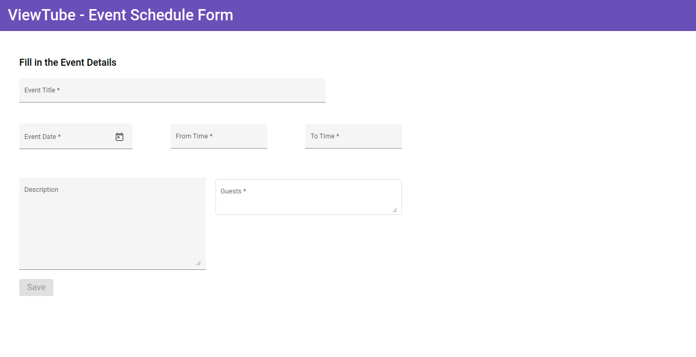
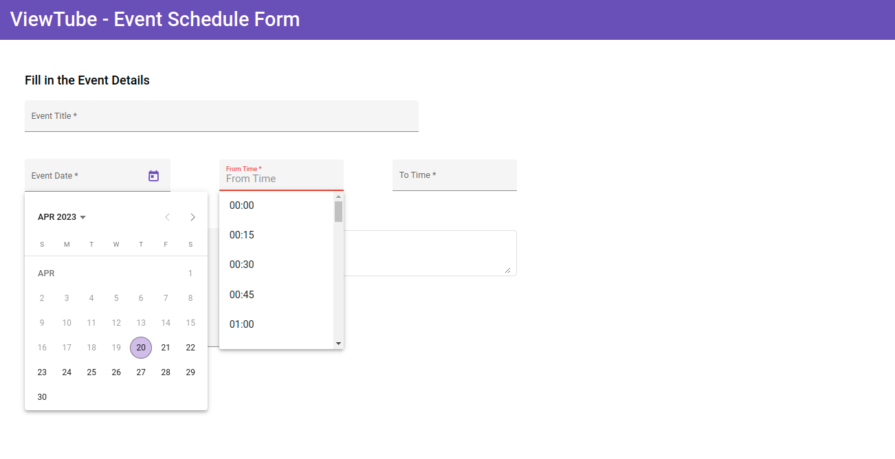
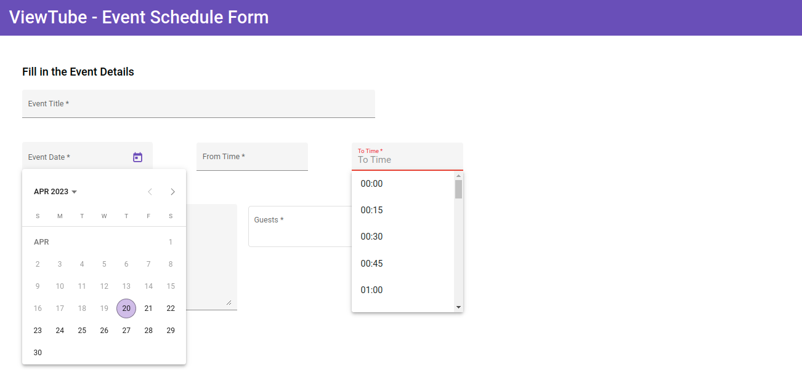
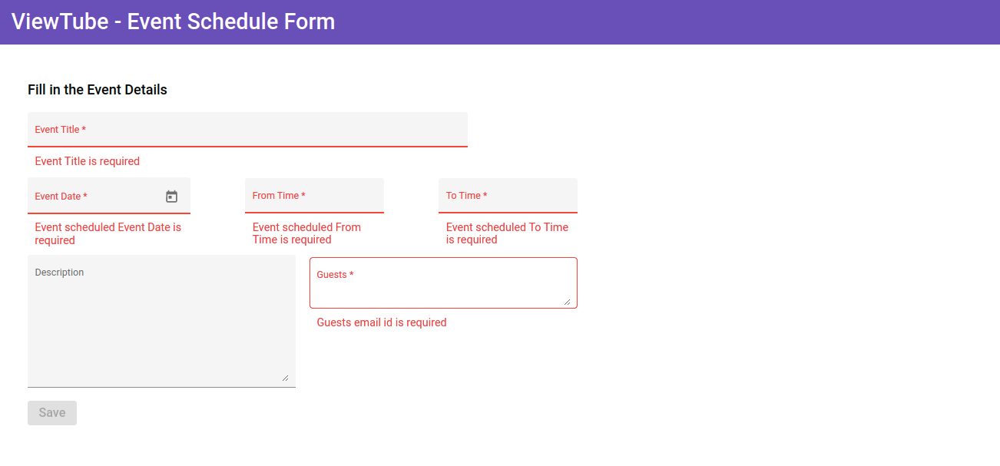
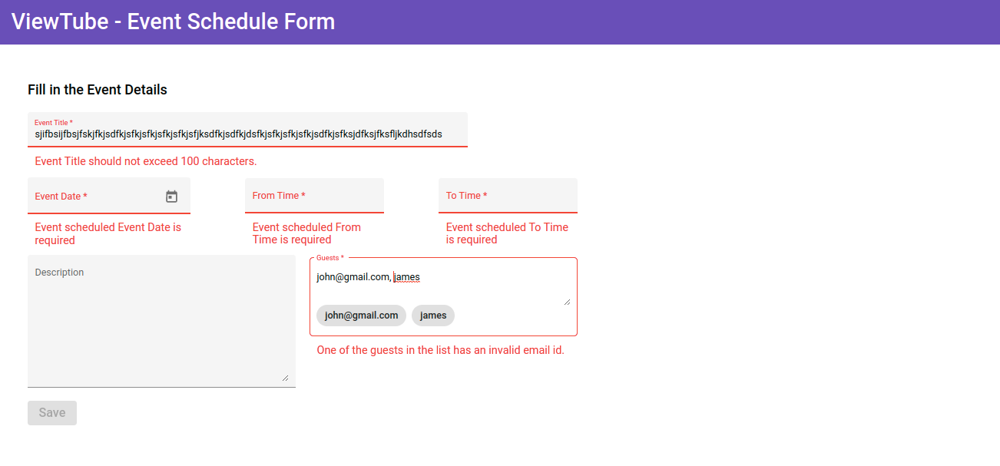
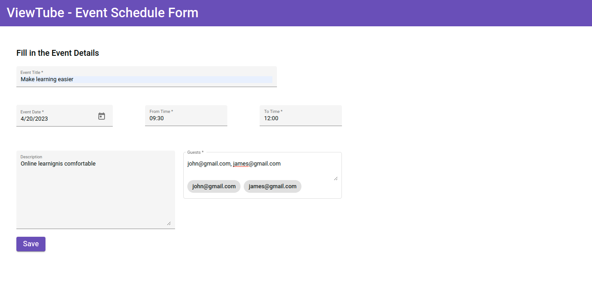
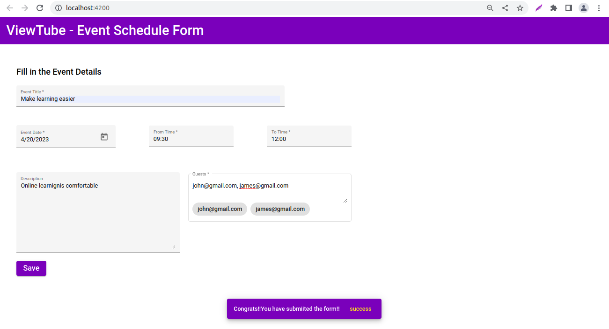

# Develop a Event Schedule Form Using Angular Reactive Form 

## Context

The application ViewTube is a single-page application that allows users to view a list of videos. These videos can be created and uploaded by anyone after they are approved by the organisation.​

The marketing team wants to expand their market by attracting more users to their ViewTube application. For this, they planned to schedule live events over the OTT (Over-The-Top) platform called ViewTube Live.​

ViewTube Live is an easy way for creators of videos to reach their respective communities in real-time. Whether streaming an event or teaching a class, or hosting a workshop, ViewTube has tools that will help manage live streams and interact with the viewers in real-time.​

As a front-end developer, you have been given the responsibility of creating a reactive form to schedule live events that is cleaner, easier to read and more maintainable. 

## Problem Statement

Create a reactive form using Angular Material components to schedule an event with various details: event title, event start date and time, event end date and time, event description, and guest list.​

​Add the specified validators for the fields to make the form more robust. 

**Reactive form created should resemble the following images:**

**Schedule Event Form**


**Schedule Event Form With Event Date and From time**

 
**Schedule Event Form With Event Date and To time**


### Task Details

Following tasks need to be completed to develop the solution for the ViewTube application: 

- Task 1: Include Required Modules ​
- Task 2: Define the `StudioLivestreamComponent` 
- Task 3: Add validators to the form controls ​ ​
- Task 4: Create the HTML form in the template  ​
- Task 5: Handle form validation​
- Task 6: Display a notification message upon successful form submission​

#### Task 1: Install Required Modules
- Add the `ReaciveFormsModule` in the application root module to enable reactive forms feature.​- Add the following modules in the application root module to create forms styled with Angular material components.​
    - MatDatePickerModule​
    - MatNativeDateModule​
    - MatInputModule​
    - MatAutocompleteModule​
    - MatChipsModule​
    - MatSnackBarModule​
    - MatButtonModule​
    - MatToolBarModule​

#### Task 2: Define the `StudioLivestreamComponent` 

- Create Live Stream component inside the ViewTube Angular application.​
 
   `ng generate component studio-livestream`​
- The command creates an Angular component with the name `studio-livestream` and updates the import statements in the `app.module.ts` file.​
- Following should be defined inside the `StudioLivestreamComponent`.​
    - Define the constructor to create a `FormBuilder` and `MatSnackBar` instance.​
      ```ts
      constructor (private fb: FormBuilder, private _snackBar: MatSnackBar){ }
    
    - Create a top-level form group instance called `liveStreamForm` using the form builder service.​
    - The Form model should have 7 form controls each representing the properties eventTitle, fromDate, fromTime, toDate, toTime, description and guests.​
    
    **Note: The component name, form group name and form control names mentioned above are used in testing and so you must use the same name while coding.**
  
    - Define a `minDate` property which is initialized to today's date. This date should be used as start date for liveStream form's `fromDate` and `toDate` property.​
    - Add a string array for time value to be used for fromTime and toTime with the following values.​
        
        `00:00, 00:15, 00:30, 00:45, 01:00 ….... till 23:45​`
    - Declare an empty string array called `guestList` to store the individual guest email id. 
    - Implement the `ngOnInit` method to split the email id's from a list of comma separated emails entered by the user and store it in `guestList` array.
        ```js
            ngOnInit(): void {​
            this.liveStream.controls['guests'].valueChanges.subscribe( (guestEmails) => { this.guestList = guestEmails?.split(',');​
            });​
            }
        ```
    -  Define getters for each of the `liveStreamForm` properties to access them in template. For e.g.​  
         ```ts
            get eventTitle(){return this.liveStream.get('eventTitle');}
        ​    
#### Task 4: Add validators to the form controls

- Following are the form controls with their validation criteria.​

|Form Control | Validation|Error Messages|
|------------|-------------|----------|
|Event Title|Should not be blank and have maximum length of 100 characters​|"Event Title is required", "Event title should not exceed 100 characters"|
|Event Date|Should not be blank and should not be less than today's date​​|"Event schedule date is required"|
|From Time|Should not be blank​|"Event schedule from time is required"|
|To Time|Should not be blank​|"Event schedule to time is required"|
|Guest Email|Should not be left blank and should accept valid email values separated by comma|"Guest email id is required", "One of the guests in the list has an invalid email id"|
|Description|No validation (Optional to type some text content)|Nil|
    
- Built-in validators like `required` and `maxLength` should be added to the form properties. ​
- Custom validator function should be added to check whether the list of guest emails entered as comma separated values are valid individually.​
- Add the custom validator along with the built-validators  for `guests` form property.
- Following logic can be used to check the validation inside the `component.ts` file.
​        
```ts
    checkIfGuestEmailsAreValid(c: AbstractControl) {
    if (c.value !== '') {
      const emailString = c.value;
      const emails = emailString.split(',').map((e: string) => e.trim());
      const emailRegex = /^(([^<>()[\]\.,;:\s@\"]+(\.[^<>()[\]\.,;:\s@\"]+)*)|(\".+\"))@(([^<>()[\]\.,;:\s@\"]+\.)+[^<>()[\]\.,;:\s@\"]{2,})$/i;
      const anyInvalidEmail = emails.every((e: string) => e.match(emailRegex) !== null);
      if (!anyInvalidEmail) {
        return { invalidGuestEmails: true }
      }
    }
    return null;
  }
  ```
  **Note: Object Keyname - `invalidGuestEmails` mentioned above is used in testing and so you must use the same name while coding.**

#### Task 5: Create the HTML form in the template​

- Build an HTML form using `<form>` tag and form controls using `<mat-form-field>` tag. 
    - Use `<input type="text">` for `eventTitle` property.​
    - Use `<mat-datepicker>` for `fromDate` and `toDate` properties.​
    - Use `<mat-autocomplete>` for `fromTime` and `toTime` form properties whose values to be populated from the component's `timeValues` array property.​
    - Use `<textarea>` for event description and guest email properties.​
    - Use `<mat-chip-list>` to display each guest email as chip populated from the `guestList` array values.​
    - Use `<button type="submit">` for saving the captured form details. It should be disabled for invalid values.​
- Associate the form model with this HTML form template.​
  - Use `formGroup` directive with the form and `formControlName` directive with the form controls to bind them.​
- Style the form with custom styles to get the expected output.​

#### Task 6: Handle Form Validation 
- Use the `formControlName` value to access ithe validation errors associated with each of the form control element. For e.g.​
  ```html
        <input  matInput placeholder="Add Title" name="eventTitle" id="eventTitle" formControlName="eventTitle" type="text">
    ```
​
- Use `<mat-error>` to display the validation error messages when input values are invalid.​
 ```html
        <mat-error class="error" *ngIf="eventTitle?.errors?.required">​
         Event Title is required​
        </mat-error>
```
- Provide custom styles for displaying the error messages.

**Schedule Event Form With Validation Errors**



**Schedule Event Form With More Validation Errors**



#### Task 7: Display a Notification message on successful Form Submission​
- Run the `json-server` to add the event data to the `events.json` file in the `data` folder.
- Inside the `LiveStreamComponent` class, define `onSubmit()` method which calls the `LiveStream` service method to save the form data in the `json-server`. The application should display a notification message "Congrats, you have submitted the form!!" using a snack bar on successful form submission.

```ts
    let liveStream: LiveStreamEvent = this.liveStreamForm.value as LiveStreamEvent;
    this.liveStreamService.addLiveStreamEvent(liveStream).subscribe({
      next: data => {
        this._snackBar.open('Congrats!!You have submiited the form!!', 'success', {
          duration: 5000,
          panelClass: ['mat-toolbar', 'mat-primary']
        })
      },
      error: err => {
        this._snackBar.open('Failed to register user !! Please Try Again Later', 'Failure', {
          duration: 3000,
          panelClass: ['mat-toolbar', 'mat-warn']
        });
      }
    });​
```
**Schedule Event Form WIth Valid Values**



**Successful Form Submission**


### Submission Instructions

#### Test the solution locally
- Test the solution first locally and then on `CodeReview` platform. Steps to test the code locally are:​
    - From the command line terminal, set the path to the folder containing cloned boilerplate code.​
    - un the command ng test or npm run test to test the solution locally and ensure all the test cases pass.​
    - Refactor the solution code if the test cases are failing and do a re-run.​​
    - Finally, push the solution to git for automated testing on `CodeReview` platform.​

#### Test the Solution on `CodeReview` platform
Steps to test the code on hobbes are:​
- Open the submission page at `https://codereview.stackroute.niit.com/#/submission`.​
- Submit the solution.​
- For the failed test cases, refactor the code locally and submit it for re-evaluation.​